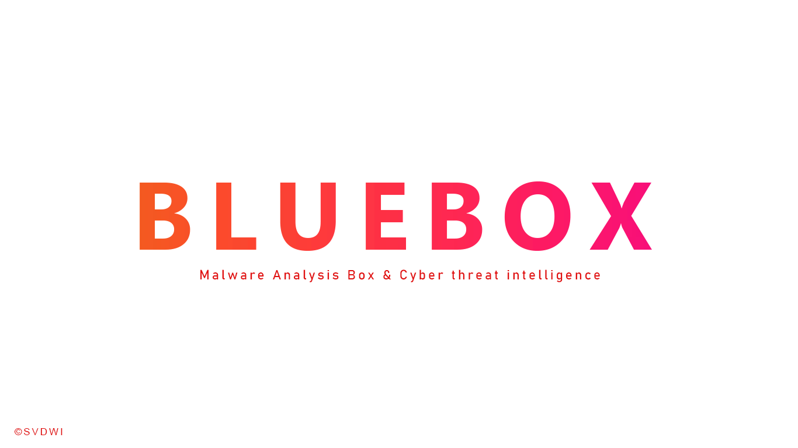

# BlueBox Malware analysis Box and Cyber threat Hunting

# About 
 **threat intelligence data** about a malware, an IP or a domain , URL ? a Quick Analysis suspicious File or Malware ! 

BlueBox is an Open Source Intelligence, or OSINT solution to get threat intelligence data about a specific file, an IP or a domain ,Url and analyze them.

## VIDEO USAGE

### Features

- Provides enrichment of threat intel for malware as well as observables (IP, Domain, URL and hash).
- This application is built to **scale out** and to **speed up the retrieval of threat info**.

-  built with Python3, Flask , js ,Bootstrap , SQLAlchemy ,Scikit-learn ,Json ,YARA Rules
-  Get threat intelligence data about a specific file, an IP or a domain,URL and Get latest Malware Ioc feeds from a single API at scale .
- Static Analysis File ( Hashes , suspicious Strings , import/Export Functions , Suspicious DLL used ).
- retrieve data from external sources (like VirusTotal).
- Detection Using YARA Rules ( crypto , packed , malware IOc )
- Detection URL,Phishing Website using Machine Learning Logistic regression .
- Checking URL,Domain External sources( Like VirusTotal).
- Extract Some Features (Lexical Features) to help detection malicious website .
- Real-time Latest ioc malware trending feeds .

## BlueBox Architecture

 

